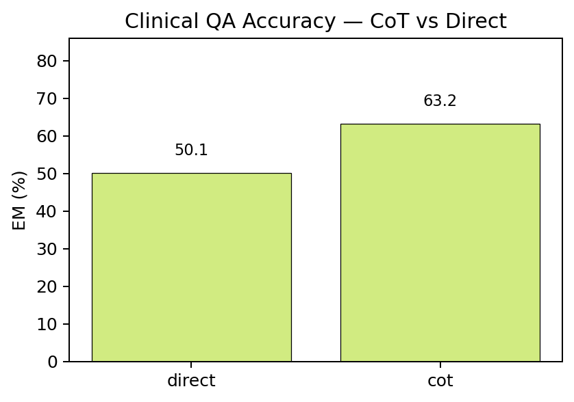
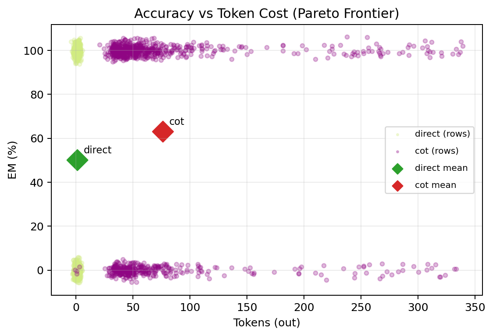
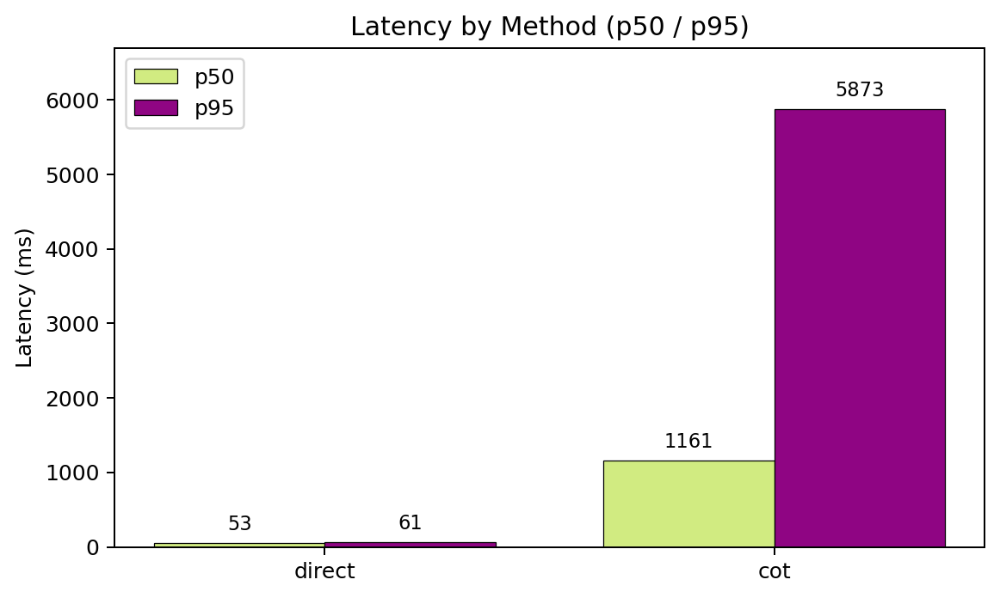
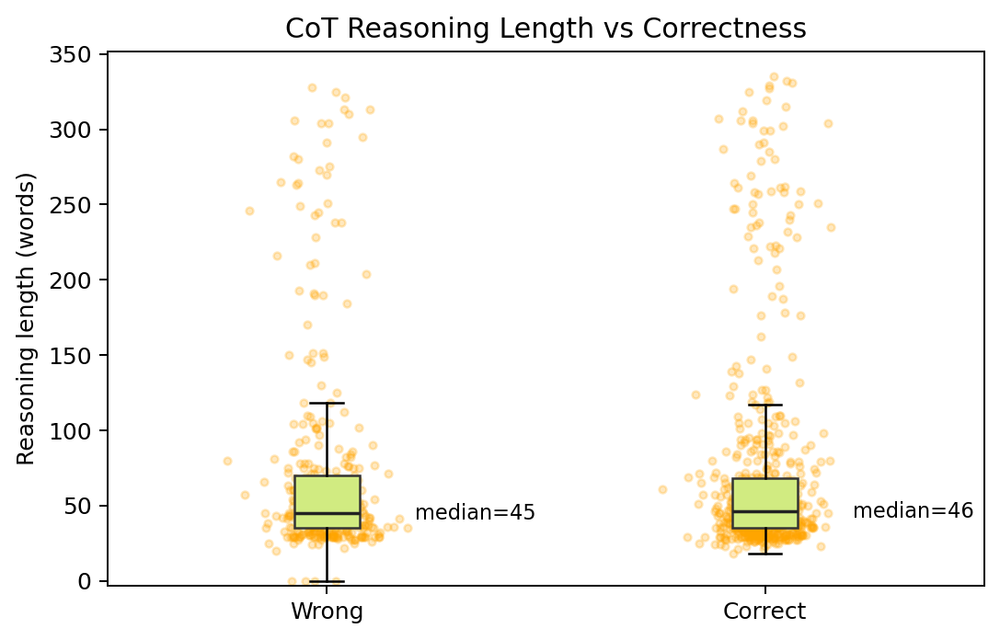
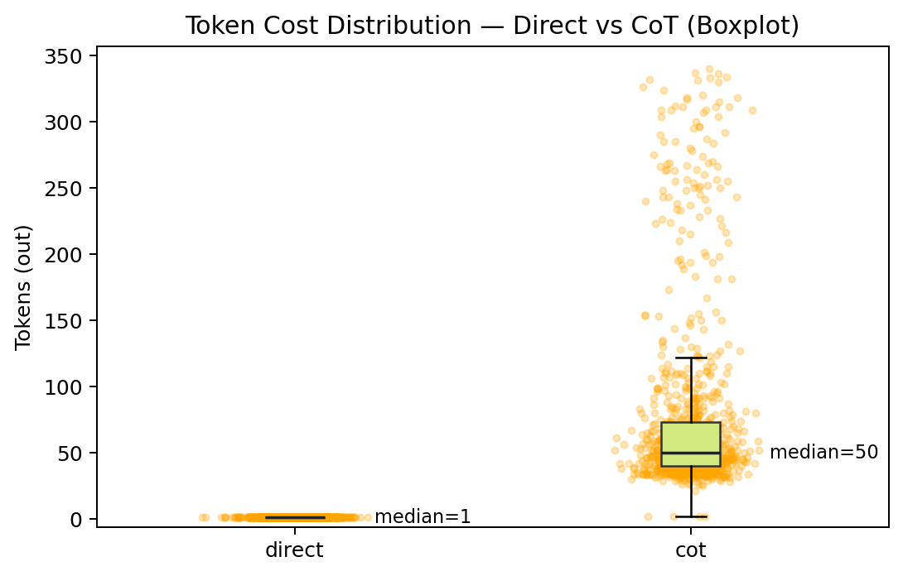
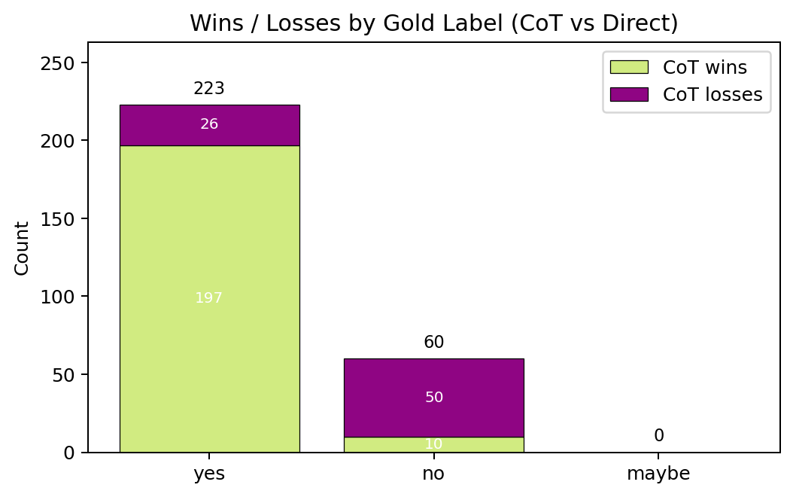

# Chain-of-Thought for PubMedQA

> CoT prompting improves accuracy by **+13 percentage points** compared to direct answering on the PubMedQA dataset.

## Inspiration
I wanted to deepen my understanding of prompt engineering, so I completed a short Coursera course covering various techniques. To put these concepts into practice, I decided to apply them to my own areas of interest—healthcare, biomedical research, and public health—with a particular focus on the Chain-of-Thought approach.


## Introduction
Chain-of-Thought (CoT) prompting is a form of prompt engineering where the model is guided to show its reasoning and **generate intermediate reasoning steps** before giving a final answer. This approach can **boost accuracy and interpretability, and thought processes**. In this project, I compare CoT prompting against direct questioning on a clinical QA task with yes/no/maybe labels. 

The goal is to test whether the added reasoning improves outcomes, and to weigh the accuracy gains against the latency and token costs, which are key consideration when deploying LLMs. 


## Dataset(PubMedQA)
This project uses the [PubMedQA-Labeled dataset](https://huggingface.co/datasets/bigbio/pubmed_qa), which contains biomedical research `questions` paired with abstracts (`context`) and gold labels (`yes`, `no`, or `maybe`). I sampled 1,000 questions, each with a reference answer and supporting context.

- **Direct Answering**: The LLM is prompted to provide a single direct answer (yes, no, maybe) without showing reasoning.

- **Chain-of-Thought (CoT) Answering**: The LLM is prompted to reason step by step before producing the final answer (yes, no, maybe). A 1-shot example is provided for each choice, guiding the model toward structured reasoning.

## Models
We use **`BioMistral`** from [HuggingFace](https://huggingface.co/BioMistral/BioMistral-7B), a large language model fine-tuned for biomedical text understanding. It was chosen because it is specifically adapted to the biomedical research domain, making it more reliable at handling PubMed abstracts compared to general-purpose LLMs. Using BioMistral ensures that both Direct and CoT answering are grounded in domain-specific knowledge rather than generic reasoning.


## Workflow
```
Dataset (PubMedQA: Questions + Abstracts)
   |
   ├─ Direct Answering (yes/no/maybe only)
   └─ Chain-of-Thought Answering (reasoning → final answer)
   |
Inference (BioMistral model)
   |
Metrics (accuracy, F1, tokens, latency)
   |
Outputs
   ├─ Plots (accuracy, latency, tokens, reasoning length)
   └─ Tables (method summary, McNemar’s test)
```


## Metrics

**Exact Match (%)**: Percentage of predictions where the model’s answer exactly matches the gold label (yes, no, maybe). Higher values mean greater accuracy.

**Latency (p50 and p95, ms)**: Median (p50) and 95th percentile (p95) response times in milliseconds, showing both typical speed and tail delays.

**Tokens (int)**: Average number of output tokens generated per response, reflecting efficiency and verbosity.

**Words Average (int)**: Average number of words in the raw model output, a proxy for reasoning length in CoT responses.


## Results: Tables

**Performance:**

| method | EM (%) | yes_correct | no_correct | maybe_correct | latency_ms_mean | tokens_out_mean | model_raw_word_avg |
| --- | --- | --- | --- | --- | --- | --- | --- |
| cot | 63.2 | 357 | 275 | 0 | 1736.2 | 76.0 | 76.0 |
| direct | 50.1 | 186 | 315 | 0 | 54.2 | 1.0 | 1.0 |

*CoT delivers a clear accuracy lift: 63.2% vs 50.1% EM (+13.1 pts). It roughly doubles “yes” wins (357 vs 186) but is weaker on “no” (275 vs 315), and neither method lands “maybe” here. The trade-off is cost: CoT averages ~1.74 s latency and ~76 tokens/words per output versus Direct’s ~54 ms and ~1 token/word—meaning CoT is far more accurate but much heavier.*

**McNemar Test:**
McNemar’s test evaluates whether two classifiers differ in accuracy on the same items, using only the discordant pairs—instances where one method is correct and the other is wrong.

|  | Direct correct | Direct wrong |
| --- | --- | --- |
| CoT correct | 425 | 207 |
| CoT wrong | 76 | 292 |
| Totals | 501 | 499 |


**McNemar (CC)**: b=207, c=76, χ²=59.717, p=1.07783e-13

*From the 2×2 table, the discordant counts are b = 207 (CoT correct, Direct wrong) and c = 76 (Direct correct, CoT wrong). Under the null of marginal homogeneity (no systematic difference), b and c should be roughly equal. 

The continuity-corrected chi-square is χ² = 59.717 with p ≈ 1.08×10⁻¹³, indicating a highly significant deviation from equality: CoT wins about 73% of disagreements (207/283). The discordant odds ratio is b/c = 2.72, with an approximate 95% CI [2.09, 3.54] (log-OR ± 1.96·√(1/b+1/c)), showing that when the methods disagree on the same question, CoT is about 2–3.5× more likely than Direct to be the one that’s correct. 

Note that McNemar ignores ties (both correct or both wrong), so this result cleanly isolates CoT’s advantage specifically on contested items.*

## Results: Visuals 



*CoT reasoning achieves 63.2% accuracy, which is 13 percentage points higher than direct answering (50.1%). This highlights a clear accuracy benefit from reasoning despite higher token costs.*

 
*The pareto scatter plots shows a clear cost–accuracy trade-off: direct answers cluster near ~0–5 (light green) tokens with mean accuracy around ~50%, while CoT spreads widely across ~30–350 tokens (purple) with a higher mean accuracy around ~64%. Means (diamond markers) make the gap explicit: CoT’s point sits notably higher on the y-axis but to the right on the x-axis. In sum, with extra generation budget, CoT buys accuracy.*

 
*This latency plot highlights the efficiency trade-off between methods. Direct answers are nearly instantaneous (p50 ≈ 53 ms, p95 ≈ 61 ms), while CoT responses are much slower (p50 ≈ 1.1 s, p95 ≈ 5.9 s) due to longer reasoning chains.*

*The p95 tail for CoT is extreme: it stretches into the multi-second range (≈ 5.9 s), more than 100× slower than direct answers. This heavy tail means that while most CoT responses fall around 1 sec, a significant fraction take several seconds, which could be unacceptable in real-time clinical QA settings. In contrast, direct answers remain tightly bounded (p95 only 61 ms), showing far less variability.*

*This shows that while CoT improves accuracy, it comes at a substantial cost in response time.*


*This boxplot shows that reasoning length does not strongly separate correct from incorrect CoT answers. Both groups have nearly identical medians (~46 words), meaning longer chains of thought don’t reliably translate to higher accuracy. However, the spread is wide: some incorrect answers ramble to 300+ words, while many correct answers stay concise. This suggests quality of reasoning matters more than length — verbosity alone doesn’t guarantee correctness.*


*This boxplot plot shows the huge token efficiency gap between direct answers and CoT. Direct responses are nearly free, with a median of just 1 token, while CoT requires about 50 tokens on average and sometimes exceeds 300+. The wide spread for CoT highlights its verbosity cost, reinforcing that its accuracy gains come with a significant trade-off in efficiency.*


*This stacked bar chart shows how CoT wins and losses break down by gold label. CoT performs strongly on “yes” questions (197 wins vs 26 losses), but struggles on “no” questions where it loses more often than it wins (50 vs 10). Both methods scored zero in the `maybe_correct` category as noted the absense of bars. However, this chart suggests CoT reasoning is especially beneficial for affirmative cases but less reliable for negative ones.*

## Next Steps
 - Implement self-consistency with CoT (sampling multiple reasoning paths and majority-voting the final answer) to reduce truncation and rambling errors.

 - Add a judge LLM module to verify whether CoT reasoning is actually supported by the context, filtering out ungrounded answers.

 - None of the methods had corrects in the `maybe` category, so perhaps fine-tuning on the model or adding more data from the PubMedQA-Artificial dataset could improve accuracy rates.

## Conclusion
This project shows that Chain-of-Thought (CoT) prompting improves accuracy over direct answering but comes with higher latency and token costs. While CoT offers clear benefits in reasoning quality, its computational overhead highlights the need for careful trade-offs in business applications where speed and cost matter.


## Tech Stack
Python, Pytorch, PyYAML, pandas, numpy, matplotlib, HugginFace, Cloud GPUs